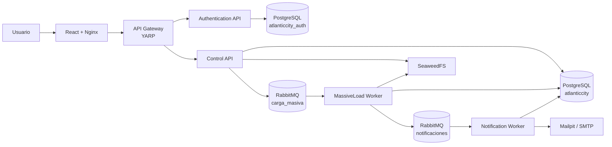
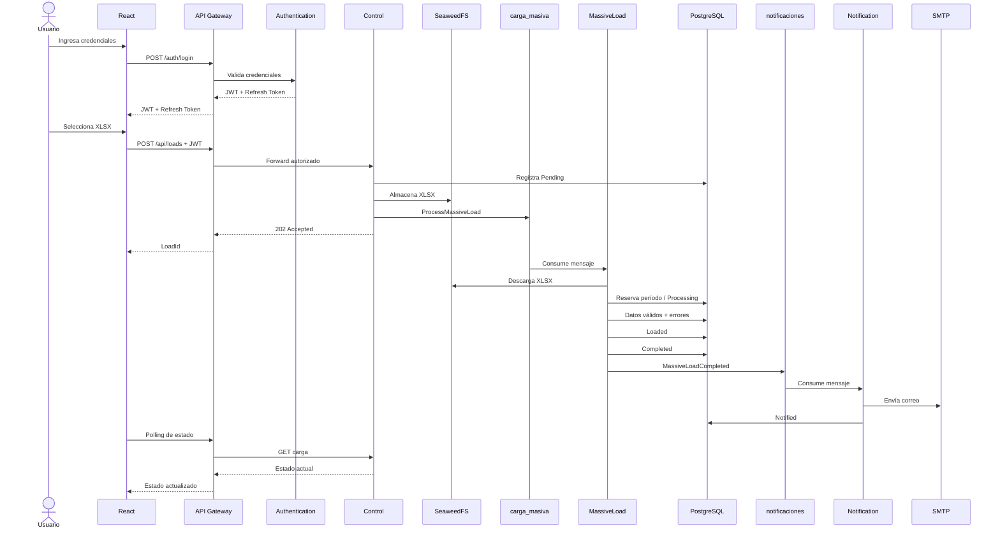

# Atlantic City 2026 — Reto Técnico Backend Senior

Plataforma distribuida de carga masiva desarrollada como solución al reto técnico **Desarrollador Backend Senior — Casino Atlantic City 2026**.

La solución implementa un flujo completo para recibir archivos Excel, almacenarlos fuera del broker, procesarlos de forma asíncrona, aplicar reglas de negocio y control de concurrencia, persistir resultados y errores, mantener trazabilidad extremo a extremo y notificar al usuario una vez finalizado el proceso.

El diseño prioriza los aspectos centrales de una solución backend distribuida:

- arquitectura de microservicios;
- Clean Architecture;
- Dependency Inversion;
- CQRS ligero;
- procesamiento asíncrono;
- mensajería RabbitMQ;
- consistencia y concurrencia;
- idempotencia;
- persistencia PostgreSQL;
- seguridad JWT;
- observabilidad;
- resiliencia;
- automatización mediante Docker y CI.

El cliente React incluido permite ejecutar y visualizar el flujo completo, pero el foco principal de la solución se encuentra en el backend.

---

## Stack principal

| Área | Tecnología |
|---|---|
| Runtime | .NET 9 |
| APIs | ASP.NET Core |
| Gateway | YARP Reverse Proxy |
| Authentication | JWT Bearer + Refresh Tokens |
| Mensajería | RabbitMQ + MassTransit |
| Procesamiento Excel | ExcelDataReader |
| Base de datos | PostgreSQL 17 |
| ORM | Entity Framework Core |
| SQL explícito | Dapper |
| Storage | SeaweedFS |
| Correo | MailKit |
| SMTP local | Mailpit |
| Resiliencia | Microsoft.Extensions.Http.Resilience / Polly |
| Logging | Structured JSON Logging |
| Frontend | React + TypeScript |
| UI | Material UI |
| Tests | xUnit + Testcontainers |
| Containers | Docker / Docker Compose |
| CI | GitHub Actions |

---

# Quick Start

## Requisitos

Para ejecutar la solución completa mediante Docker solamente se necesita:

- Git;
- Docker Desktop;
- Docker Compose v2.

> No es necesario instalar localmente .NET, Node.js, PostgreSQL, RabbitMQ, SeaweedFS o Mailpit.

## 1. Levantar toda la plataforma

Desde la raíz del repositorio:

```bash
docker compose up --build -d
```

Verificar los servicios:

```bash
docker compose ps
```

Los servicios deben quedar en estado `Up`.

PostgreSQL y RabbitMQ deben aparecer además como `healthy`.

---

## 2. Abrir la aplicación

```text
http://localhost:3000
```

---

## 3. Credenciales de evaluación

| Campo | Valor |
|---|---|
| Usuario | `admin@atlanticcity.pe` |
| Contraseña | `AtlanticCity.Admin.2026!` |

El usuario de demostración es creado automáticamente durante la inicialización del microservicio de Authentication.

No es necesario crear manualmente usuarios, bases de datos, tablas o esquemas.

---

## 4. Archivo para probar el happy path

Utilizar:

```text
samples/carga-prueba-atlantic-city.xlsx
```

Sobre una instalación limpia:

```bash
docker compose down -v
docker compose up --build -d
```

la carga debe recorrer:

```text
Pending
   ↓
Processing
   ↓
Loaded
   ↓
Completed
   ↓
Notified
```

con resultado:

```text
Success
```

Si posteriormente se intenta procesar nuevamente el mismo período, la nueva carga puede finalizar:

```text
Status: Notified
Result: Rejected
```

Esto es comportamiento esperado.

El procesamiento técnico y la notificación terminan correctamente, pero la carga es rechazada debido a la regla de negocio de duplicidad por período.

---

# Smoke Test automatizado

Con la plataforma levantada:

```powershell
.\scripts\smoke-test.ps1
```

El smoke test valida de extremo a extremo:

```text
Disponibilidad
      ↓
Authentication
      ↓
JWT
      ↓
Gateway
      ↓
Upload XLSX
      ↓
SeaweedFS
      ↓
RabbitMQ
      ↓
MassiveLoad
      ↓
PostgreSQL
      ↓
Notification
      ↓
MailKit
      ↓
Notified
```

Además valida la propagación del `CorrelationId`.

Resultado esperado:

```text
SMOKE TEST PASSED
```

Para repetir el happy path desde una instalación limpia:

```bash
docker compose down -v
docker compose up --build -d
```

y posteriormente:

```powershell
.\scripts\smoke-test.ps1
```

---

# URLs del entorno

| Componente | URL |
|---|---|
| Aplicación React | http://localhost:3000 |
| API Gateway | http://localhost:5017 |
| Authentication API | http://localhost:5149 |
| Control API | http://localhost:5112 |
| RabbitMQ Management | http://localhost:15672 |
| Mailpit | http://localhost:8025 |
| SeaweedFS Filer | http://localhost:8888 |
| SeaweedFS Master | http://localhost:9333 |
| PostgreSQL | localhost:5432 |

## RabbitMQ Management

```text
Usuario:     atlanticcity
Contraseña: atlanticcity_dev_2026
```

Las credenciales incluidas en el repositorio pertenecen exclusivamente al entorno local utilizado para evaluación.

En producción deben reemplazarse por secretos administrados externamente.

---

# Arquitectura

La solución está dividida en procesos independientes.

Las operaciones síncronas utilizan HTTP sólo donde resulta necesario. El procesamiento de la carga y la notificación se desacoplan mediante mensajería asíncrona.



---

# Componentes Backend

## API Gateway

Implementado mediante **YARP Reverse Proxy**.

Es el único punto de entrada HTTP utilizado por el cliente para consumir los servicios backend.

Responsabilidades:

- routing;
- validación de JWT;
- autorización;
- autorización basada en permisos;
- rate limiting;
- propagación de `X-Correlation-Id`;
- manejo estandarizado de errores;
- forwarding hacia los servicios internos.

Las operaciones de lectura y ejecución utilizan políticas distintas.

Permisos principales:

```text
mass-load.read
mass-load.execute
```

---

## Authentication

Microservicio responsable de autenticación e identidad.

Responsabilidades:

- validar credenciales;
- generar JWT Bearer;
- generar claims;
- administrar permisos;
- generar Refresh Tokens;
- rotar Refresh Tokens;
- revocar Refresh Tokens;
- persistir tokens de forma segura;
- crear automáticamente el usuario de evaluación.

Endpoints:

```text
POST /auth/login
POST /auth/refresh
POST /auth/revoke
```

Authentication mantiene una base de datos independiente:

```text
atlanticcity_auth
```

### JWT

El Access Token incluye claims como:

```text
sub
email
name
role
permission
jti
```

El Gateway valida:

```text
Issuer
Audience
Signing Key
Lifetime
```

### Refresh Tokens

Los Refresh Tokens son generados mediante un generador criptográficamente seguro.

El token recibido por el cliente no se almacena directamente en PostgreSQL.

Se persiste un hash del token y se implementan:

```text
rotación
revocación
expiración
control de concurrencia
```

Esto permite reducir el impacto de una eventual exposición de la base de datos.

---

## Control

Microservicio HTTP responsable de aceptar y registrar una nueva carga.

Responsabilidades:

- recibir archivos `.xlsx`;
- validar archivo requerido;
- validar extensión;
- validar tamaño;
- validar contexto del usuario;
- comprobar permisos;
- registrar quién realizó la carga;
- generar trazabilidad;
- crear el registro inicial `Pending`;
- almacenar el Excel en SeaweedFS;
- publicar el trabajo en RabbitMQ;
- exponer queries del procesamiento.

El Excel **no se procesa dentro de la petición HTTP**.

El flujo HTTP finaliza después de registrar el trabajo y publicarlo para procesamiento asíncrono.

Respuesta:

```text
202 Accepted
```

con:

```text
loadId
status
correlationId
```

Esto mantiene la API desacoplada del tiempo requerido para procesar el archivo.

---

## MassiveLoad

Worker responsable del procesamiento real del Excel.

Es el componente donde se concentra la mayor parte de las reglas funcionales.

Responsabilidades:

- consumir `carga_masiva`;
- descargar el archivo desde SeaweedFS;
- validar estructura;
- leer Excel;
- normalizar información;
- resolver el período;
- controlar concurrencia por período;
- evitar reprocesamiento;
- ignorar filas completamente vacías;
- aplicar valores por defecto;
- identificar productos existentes;
- persistir registros válidos;
- registrar errores de procesamiento;
- actualizar estados;
- publicar el resultado en `notificaciones`.

Estados administrados durante esta etapa:

```text
Processing
Loaded
Completed
```

---

## Notification

Worker encargado de completar el flujo mediante correo electrónico.

Responsabilidades:

- consumir `notificaciones`;
- recuperar la carga;
- validar su estado;
- construir la notificación;
- enviar correo mediante MailKit;
- prevenir reprocesamiento de cargas ya notificadas;
- registrar historial;
- actualizar la carga a `Notified`.

En el entorno local se utiliza Mailpit como servidor SMTP.

---

# Flujo completo



---

# Estados y resultados

Una decisión importante del modelo consiste en separar **estado operacional** de **resultado funcional**.

## Estados

```text
Pending
Processing
Loaded
Completed
Notified
```

Representan dónde se encuentra la carga dentro del pipeline.

## Resultados

```text
Pending
Success
Partial
Rejected
Failed
```

Representan el resultado funcional de la carga.

Por ejemplo:

```text
Status = Notified
Result = Rejected
```

es perfectamente válido.

Significa que:

1. la carga fue procesada;
2. una regla de negocio provocó su rechazo;
3. el proceso terminó;
4. el usuario fue notificado.

Esta separación evita mezclar el estado técnico del workflow con el resultado del negocio.

---

# Reglas de negocio

## Duplicidad por período

Cada Excel contiene:

```text
Periodo
```

Antes de persistir los productos se intenta reservar el período.

Las reglas son:

```text
Carga previa Pending / Processing
            ↓
          BLOCK

Carga previa Loaded / Completed / Notified
            ↓
          REJECT

Sin carga previa para el período
            ↓
         CONTINUE
```

La validación no depende de locks en memoria.

Se implementa en PostgreSQL mediante:

```text
sp_try_reserve_load_period
```

El procedimiento utiliza locking transaccional para serializar los intentos correspondientes al mismo período.

La estrategia permite mantener la regla incluso si existen múltiples instancias del worker.

---

## Protección frente a race conditions

Una validación basada únicamente en:

```text
SELECT
  ↓
IF NOT EXISTS
  ↓
INSERT
```

permitiría que dos workers procesaran simultáneamente el mismo período.

Por ello la reserva utiliza PostgreSQL y un lock transaccional asociado al período.

Conceptualmente:

```text
Worker A ─┐
          ├──> PostgreSQL lock(periodo)
Worker B ─┘
                   ↓
          sólo uno puede reservar
```

La consistencia no depende de la memoria de una instancia concreta.

---

## Idempotencia de reserva

Un mensaje puede ser entregado nuevamente debido a la semántica `at-least-once`.

Si la misma carga ya reservó el período y se encuentra en `Processing`, la reserva reconoce al propietario existente y evita generar una segunda reserva.

Esto permite tolerar redelivery sin convertir una reentrega en una nueva carga funcional.

---

## Duplicidad de productos

El archivo contiene:

```text
CodigoProducto
```

`CodigoProducto` es tratado como identificador funcional único.

Cuando ya existe:

```text
no se inserta
      ↓
se contabiliza como Existing
      ↓
se registra PRODUCT_EXISTS
```

El error queda asociado a:

```text
LoadId
número de fila
CodigoProducto
datos originales
```

permitiendo mantener trazabilidad.

PostgreSQL posee además una restricción de unicidad, por lo que la consistencia no depende exclusivamente de una comprobación en código.

---

## Campos vacíos

Cuando una columna permitida se encuentra vacía se aplican valores por defecto.

```text
Texto    → N/A
Integer  → 0
Decimal  → 0
```

---

## CodigoProducto vacío

Cuando una fila procesable no contiene `CodigoProducto`, el sistema genera un identificador trazable utilizando:

```text
LoadId
+
RowNumber
```

Formato conceptual:

```text
SIN-CODIGO-{loadId}-{row}
```

De esta forma el registro continúa siendo identificable durante el procesamiento.

---

## Filas completamente vacías

Las filas sin información son ignoradas.

```text
fila vacía
    ↓
 ignore
```

No generan:

```text
registro
error
contador procesado
```

---

# Formato esperado del Excel

Columnas:

```text
Periodo
CodigoProducto
NombreProducto
Descripcion
Categoria
Cantidad
Precio
```

El worker valida la estructura del archivo antes de persistir la información.

---

# Archivos de prueba

El directorio `samples/` contiene escenarios preparados para validar distintas reglas.

```text
samples/
├── carga-prueba-atlantic-city.xlsx
├── carga-prueba-campos-vacios.xlsx
├── carga-prueba-columnas-faltantes.xlsx
├── carga-prueba-corrupta.xlsx
├── carga-prueba-datos-invalidos.xlsx
└── carga-prueba-productos-existentes.xlsx
```

Permiten verificar:

```text
happy path
valores por defecto
columnas faltantes
archivo corrupto
datos inválidos
productos existentes
duplicidad por período
```

---

# Mensajería

La plataforma utiliza **RabbitMQ** mediante **MassTransit**.

Existen dos colas principales:

```text
carga_masiva
notificaciones
```

Flujo:

```text
Control
   ↓
carga_masiva
   ↓
MassiveLoad
   ↓
notificaciones
   ↓
Notification
```

---

## Exchange

Los endpoints de los consumidores utilizan explícitamente:

```text
ExchangeType = direct
```

cumpliendo el requerimiento de intercambio `direct` o `topic`.

Las colas son configuradas como durables y no auto-delete.

---

## El Excel no viaja por RabbitMQ

El archivo binario no se publica como payload.

El flujo utilizado es:

```text
Excel
  ↓
SeaweedFS
  ↓
StoragePath
  ↓
RabbitMQ
```

RabbitMQ transporta únicamente metadata y la referencia al archivo.

Esto evita convertir el message broker en almacenamiento de archivos grandes.

---

# Garantía de entrega e idempotencia

La mensajería utiliza semántica:

```text
at-least-once
```

Por definición, un mensaje puede volver a ser entregado.

Los consumidores fueron diseñados considerando este comportamiento.

MassiveLoad detecta cargas que ya alcanzaron estados finales y evita procesarlas nuevamente.

Notification detecta cargas `Notified` y evita volver a aplicar la transición final.

Esto permite tolerar redelivery sin asumir una garantía de `exactly-once` inexistente en sistemas distribuidos.

---

# Retry

Los consumidores RabbitMQ poseen una política de reintentos escalonada:

```text
2 segundos
5 segundos
10 segundos
```

Esto permite absorber errores transitorios antes de considerar fallido el procesamiento del mensaje.

---

# Resiliencia HTTP

La descarga de archivos desde SeaweedFS utiliza un resilience pipeline.

Incluye:

```text
Retry
Attempt Timeout
Total Request Timeout
Circuit Breaker
Jitter
```

Configuración principal:

```text
Retry attempts:      1
Retry delay:         500 ms + jitter
Attempt timeout:     20 s
Total timeout:       45 s

Circuit Breaker
Failure ratio:       0.5
Minimum throughput:  4
Sampling duration:   60 s
Break duration:      15 s
```

El upload hacia SeaweedFS no utiliza un retry automático sobre el mismo `Stream`.

Esta decisión es intencional: reintentar de forma ciega un stream no replayable puede producir operaciones inseguras o parciales.

---

# SMTP e idempotencia

SMTP representa un side effect externo y no participa de la misma transacción de PostgreSQL.

Existe una ventana teórica:

```text
SMTP acepta correo
       ↓
proceso termina inesperadamente
       ↓
Notified todavía no fue persistido
       ↓
mensaje es redelivered
```

En ese escenario el proveedor SMTP podría recibir nuevamente el correo.

La solución evita afirmar una garantía `exactly-once` que SMTP estándar no proporciona.

El análisis completo se encuentra en:

```text
docs/architecture/notification-delivery.md
```

En una solución productiva con requerimientos estrictos se podrían evaluar mecanismos adicionales como Outbox/Inbox o idempotency keys soportadas por el proveedor.

---

# Persistencia

Se utiliza PostgreSQL como motor relacional.

Bases:

```text
atlanticcity
atlanticcity_auth
```

`atlanticcity_auth` pertenece al contexto de Authentication.

`atlanticcity` mantiene el lifecycle operativo de las cargas.

---

## EF Core + Dapper

Se eligió deliberadamente una estrategia híbrida.

### Entity Framework Core

Se utiliza principalmente para:

```text
modelo
mapping
migrations
persistencia convencional
```

### Dapper

Se utiliza para:

```text
queries
operaciones SQL explícitas
procesamiento masivo
stored procedure
transiciones donde se requiere control SQL directo
```

La decisión evita forzar una única tecnología de acceso a datos para todos los escenarios.

---

## Entidades funcionales principales

```text
carga_archivo
data_procesada
detalle_carga_error
historial_estado_carga
```

Authentication mantiene adicionalmente su propio modelo de:

```text
users
refresh tokens
```

---

# Stored Procedure

La exclusión funcional por período utiliza:

```text
sp_try_reserve_load_period
```

El procedimiento se encarga de realizar la reserva de forma transaccional.

Entre otros mecanismos utiliza:

```text
PostgreSQL advisory transaction lock
row locking
validación de estado
detección de conflicto
idempotencia de reserva
```

Posibles decisiones resultantes:

```text
RESERVED
ALREADY_RESERVED
BLOCKED
REJECTED
LOAD_NOT_FOUND
INVALID_STATUS
```

La implementación evita depender de sincronización en memoria y continúa siendo válida al escalar horizontalmente los workers.

---

# Constraints de base de datos

Las reglas críticas no dependen únicamente del application code.

PostgreSQL protege también la consistencia mediante:

```text
primary keys
foreign keys
unique indexes
check constraints
```

Entre las restricciones funcionales se encuentran:

```text
unicidad de CodigoProducto
unicidad de fila dentro de una carga
estados permitidos
resultados permitidos
contadores no negativos
protección del período
```

La base de datos funciona como última línea de defensa de invariantes importantes.

---

# Migraciones

Las aplicaciones utilizan **EF Core Migrations**.

Durante el startup se aplican las migraciones necesarias automáticamente.

Una instalación limpia mediante Docker no requiere ejecutar:

```bash
dotnet ef database update
```

manualmente.

El bootstrap inicial de PostgreSQL incluye:

```text
database/init/01-create-auth-database.sql
```

para crear la base dedicada de Authentication.

El esquema restante se administra mediante migraciones.

---

# Scripts SQL de despliegue

Además de las migraciones automáticas, el proyecto incluye scripts SQL correspondientes a los contextos de persistencia:

```text
database/scripts/authentication.sql
database/scripts/control.sql
```

`authentication.sql` contiene el esquema correspondiente al servicio de Authentication.

`control.sql` contiene el esquema operacional de carga masiva, incluyendo tablas, restricciones, índices y:

```text
sp_try_reserve_load_period
```

Estos scripts permiten:

```text
inspección del modelo
deployment manual
revisión técnica
auditoría de cambios
```

El mecanismo estándar para ejecutar la solución continúa siendo la aplicación automática de migraciones durante el startup.

---

# Ownership de datos

Authentication posee su propia base:

```text
atlanticcity_auth
```

Mientras que:

```text
Control
MassiveLoad
Notification
```

participan sobre el mismo lifecycle operacional de una carga en:

```text
atlanticcity
```

Esta decisión responde al alcance del challenge, donde los tres componentes operan directamente sobre la trazabilidad de `CargaArchivo` y el servicio de Notification debe completar la transición final a `Notified`.

En una plataforma de mayor escala podría evolucionarse hacia ownership completamente independiente por servicio utilizando:

```text
integration events
projections
outbox
eventual consistency
```

Para este alcance se priorizó mantener consistencia transaccional sin introducir complejidad distribuida innecesaria.

---

# Seguridad

La solución implementa:

```text
JWT Bearer
Issuer validation
Audience validation
Signing Key validation
Token lifetime validation
Claims
Roles
Permissions
Refresh Tokens
Refresh Token rotation
Refresh Token revocation
Protected endpoints
Rate Limiting
```

Los permisos relevantes son:

```text
mass-load.read
mass-load.execute
```

---

# Rate Limiting

El Gateway implementa Fixed Window Rate Limiting.

Configuración:

```text
100 requests / minute
QueueLimit = 0
```

El rate limit es particionado utilizando:

```text
usuario autenticado → sub
usuario anónimo     → IP
```

De esta forma diferentes usuarios no comparten necesariamente el mismo contador global.

Al superar el límite:

```text
HTTP 429 Too Many Requests
```

---

# Manejo global de errores

Las APIs utilizan un manejador global basado en `ProblemDetails`.

Content-Type:

```text
application/problem+json
```

El formato puede incluir:

```text
status
title
detail
code
correlationId
```

Ejemplos de códigos:

```text
INVALID_CREDENTIALS
INVALID_REFRESH_TOKEN
FILE_REQUIRED
INVALID_FILE_EXTENSION
EMPTY_FILE
FILE_TOO_LARGE
INVALID_USER_CONTEXT
LOAD_NOT_FOUND
VALIDATION_ERROR
BAD_REQUEST
UNEXPECTED_ERROR
```

Las excepciones inesperadas no exponen información interna en producción.

---

# Observabilidad

Todos los procesos .NET generan logging estructurado en JSON.

Se utiliza:

```text
X-Correlation-Id
```

para correlacionar operaciones.

Si el cliente envía el identificador, éste se conserva cuando es válido.

Si no lo proporciona, se genera automáticamente.

El identificador viaja conceptualmente por:

```text
HTTP Request
     ↓
Gateway
     ↓
Control
     ↓
RabbitMQ
     ↓
MassiveLoad
     ↓
RabbitMQ
     ↓
Notification
```

Los logs utilizan scopes que permiten incluir información como:

```text
CorrelationId
LoadId
```

Esto permite seguir un procesamiento completo entre componentes independientes.

---

# Auditoría y trazabilidad

La aplicación mantiene historial explícito de estados.

```text
Pending
Processing
Loaded
Completed
Notified
```

Además registra fallas funcionales asociadas a la carga y, cuando aplica, a la fila del Excel.

Información disponible:

```text
LoadId
estado
resultado
usuario
fecha
CorrelationId
fila
campo
código de error
mensaje
datos originales
```

La trazabilidad no depende exclusivamente de los logs: también forma parte del modelo persistente.

---

# Correo

La notificación utiliza **MailKit**.

Durante evaluación Docker se utiliza Mailpit.

## Mailpit

```text
http://localhost:8025
```

## SMTP

```text
localhost:1025
```

La configuración SMTP puede ser sobrescrita mediante variables de entorno.

El correo contiene información como:

```text
LoadId
resultado
total de registros
insertados
existentes
inválidos
CorrelationId
```

---

# SeaweedFS

SeaweedFS funciona como almacenamiento externo del Excel.

Flujo:

```text
Control
   ↓
SeaweedFS
   ↓
StoragePath
   ↓
RabbitMQ
   ↓
MassiveLoad
   ↓
SeaweedFS
```

El worker descarga el archivo únicamente cuando recibe el mensaje correspondiente.

## Filer

```text
http://localhost:8888
```

## Master

```text
http://localhost:9333
```

---

# API

La entrada principal durante ejecución Docker es:

```text
http://localhost:5017
```

Las operaciones funcionales deben accederse a través del Gateway.

---

## Authentication

### Login

```http
POST /auth/login
Content-Type: application/json
```

Body:

```json
{
  "email": "admin@atlanticcity.pe",
  "password": "AtlanticCity.Admin.2026!"
}
```

La respuesta contiene:

```text
Access Token
Refresh Token
tipo Bearer
fecha de expiración
información del usuario
rol
permisos
```

---

### Refresh Token

```http
POST /auth/refresh
Content-Type: application/json
```

Permite renovar la sesión mediante un Refresh Token válido.

La operación realiza rotación del token.

---

### Revoke

```http
POST /auth/revoke
Content-Type: application/json
```

Revoca el Refresh Token suministrado.

---

# Loads API

Los endpoints requieren JWT y los permisos correspondientes.

## Nueva carga

```http
POST /api/loads
Authorization: Bearer {token}
Content-Type: multipart/form-data
```

Form:

```text
File = archivo.xlsx
```

Respuesta:

```text
202 Accepted
```

incluyendo:

```text
loadId
status
correlationId
```

---

## Listar cargas

```http
GET /api/loads?page=1&pageSize=20
Authorization: Bearer {token}
```

Filtros soportados:

```text
period
status
result
```

Ejemplo:

```http
GET /api/loads?page=1&pageSize=20&period=2026-09&status=Notified&result=Success
```

---

## Detalle de carga

```http
GET /api/loads/{loadId}
Authorization: Bearer {token}
```

---

## Historial

```http
GET /api/loads/{loadId}/history
Authorization: Bearer {token}
```

---

## Datos procesados

```http
GET /api/loads/{loadId}/data?page=1&pageSize=50
Authorization: Bearer {token}
```

---

## Errores

```http
GET /api/loads/{loadId}/errors?page=1&pageSize=50
Authorization: Bearer {token}
```

Los endpoints de datos y errores soportan paginación y limitan el tamaño máximo solicitado.

---

# Clean Architecture

Los servicios de negocio siguen una separación conceptual:

```text
Domain
   ↑
Application
   ↑
Infrastructure
   ↑
API / Worker
```

La dirección de las dependencias mantiene la lógica funcional separada de detalles externos como:

```text
PostgreSQL
RabbitMQ
SeaweedFS
SMTP
HTTP
```

---

## Domain

Contiene reglas y conceptos funcionales.

Ejemplos:

```text
LoadFile
LoadStatus
LoadResult
PeriodResolver
ProductRowCleaner
ProcessedProduct
```

---

## Application

Contiene casos de uso y contratos.

Ejemplos:

```text
Commands
Queries
Handlers
Interfaces de persistencia
Interfaces de mensajería
Interfaces de almacenamiento
Interfaces de correo
```

---

## Infrastructure

Implementa los contratos definidos por las capas superiores.

Ejemplos:

```text
Entity Framework Core
Dapper
Npgsql
RabbitMQ / MassTransit
SeaweedFS HTTP client
ExcelDataReader
MailKit
```

---

## API / Worker

Representa el punto de composición del proceso.

Su responsabilidad principal consiste en:

```text
configuración
dependency injection
middlewares
hosting
endpoints / consumers
```

La lógica funcional permanece fuera del `Program.cs`.

---

# Dependency Inversion

Los casos de uso no dependen directamente de tecnologías concretas.

Por ejemplo, Control trabaja conceptualmente contra:

```text
ILoadRepository
ILoadFileStorage
ILoadProcessingPublisher
```

MassiveLoad trabaja contra:

```text
ILoadFileSource
IExcelLoadReader
IMassiveLoadStore
```

Notification utiliza:

```text
INotificationStore
INotificationEmailSender
```

La infraestructura implementa posteriormente estos contratos.

Esto mejora:

```text
testabilidad
mantenibilidad
separación de responsabilidades
capacidad de evolución
```

---

# CQRS ligero

La solución utiliza una separación explícita entre operaciones que modifican estado y consultas.

Ejemplos:

```text
CreateLoadCommand
ProcessMassiveLoadCommand
SendLoadNotificationCommand
```

y queries como:

```text
ListLoadsQuery
GetLoadDetailQuery
GetLoadHistoryQuery
GetLoadDataQuery
GetLoadErrorsQuery
```

Cada operación posee su handler correspondiente.

Se optó por **CQRS ligero**, evitando agregar un mediator únicamente como infraestructura ceremonial.

Para el alcance del challenge se privilegió mantener explícito el flujo de dependencias y reducir complejidad accidental.

---

# Principios de diseño

La implementación busca mantener responsabilidades acotadas:

```text
Controller
    ↓
Application Handler
    ↓
Interface
    ↓
Infrastructure implementation
```

Los controllers no contienen procesamiento del Excel.

Los workers no contienen acceso SQL directamente en `Program.cs`.

Los casos de uso no conocen detalles de RabbitMQ, SeaweedFS o MailKit.

Los contratos compartidos de mensajería se encuentran en BuildingBlocks independientes.

---

# Docker

Toda la plataforma se encuentra orquestada mediante:

```text
docker-compose.yml
```

Servicios:

```text
postgres
rabbitmq
seaweed-master
seaweed-volume
seaweed-filer
mailpit
authentication-api
control-api
massive-load-worker
notification-worker
gateway
web
```

---

# Dockerfiles independientes

Cada proceso ejecutable posee su propio Dockerfile.

```text
src/
├── Gateway/
│   └── AtlanticCity.Gateway/
│       └── Dockerfile
│
└── Services/
    ├── Authentication/
    │   └── AtlanticCity.Authentication.Api/
    │       └── Dockerfile
    │
    ├── Control/
    │   └── AtlanticCity.Control.Api/
    │       └── Dockerfile
    │
    ├── MassiveLoad/
    │   └── AtlanticCity.MassiveLoad.Worker/
    │       └── Dockerfile
    │
    └── Notification/
        └── AtlanticCity.Notification.Worker/
            └── Dockerfile

web/
└── Dockerfile
```

Los Dockerfiles utilizan multi-stage build para separar compilación y runtime.

---

# Comandos Docker

## Build + Start

```bash
docker compose up --build -d
```

## Estado

```bash
docker compose ps
```

## Logs completos

```bash
docker compose logs -f
```

## Logs de un servicio

Ejemplo:

```bash
docker compose logs -f massive-load-worker
```

o:

```bash
docker compose logs -f control-api
```

## Detener

```bash
docker compose down
```

## Reset completo

```bash
docker compose down -v
```

## Simular evaluación desde cero

```bash
docker compose down -v
docker compose up --build -d
```

Posteriormente:

```powershell
.\scripts\smoke-test.ps1
```

---

# Testing

La solución contiene pruebas unitarias y de integración.

Las pruebas de integración utilizan PostgreSQL real mediante **Testcontainers**, permitiendo validar comportamiento SQL y concurrencia contra un motor real.

## Restore

```bash
dotnet restore AtlanticCity.MassiveLoad.sln
```

## Build

```bash
dotnet build AtlanticCity.MassiveLoad.sln -c Release
```

## Tests

```bash
dotnet test AtlanticCity.MassiveLoad.sln -c Release --no-build
```

Estado validado durante el desarrollo:

```text
Total:  40
Passed: 40
Failed: 0
```

Las pruebas cubren entre otros escenarios:

```text
Authentication
Refresh Tokens
reglas del dominio
parsing Excel
valores por defecto
validaciones
persistencia
duplicidad
concurrencia de período
Notification
idempotencia
```

---

# Tests de concurrencia

Las reglas de período poseen pruebas de integración utilizando PostgreSQL real.

Esto resulta especialmente importante porque la garantía depende de semántica propia de PostgreSQL y no puede validarse correctamente únicamente mediante mocks.

La prueba permite verificar que dos intentos concurrentes para el mismo período no puedan continuar simultáneamente.

---

# Frontend

Se incluye una interfaz funcional para facilitar la evaluación end-to-end.

Stack:

```text
React
TypeScript
Vite
Material UI
TanStack React Query
React Router
Axios
```

Pantallas:

```text
Login
Nueva carga
Historial
Detalle
Datos procesados
Errores
Historial de estados
```

El estado se actualiza mediante polling.

El frontend funciona como cliente de demostración de la plataforma; las decisiones arquitectónicas principales se encuentran en el backend.

---

# Validación Frontend

```bash
cd web
npm ci
npm run lint
npm run build
```

---

# CI

El repositorio incluye:

```text
.github/workflows/ci.yml
```

GitHub Actions valida independientemente backend, frontend y Docker.

Flujo conceptual:

```text
BACKEND

Restore
  ↓
Build Release
  ↓
Tests
```

```text
FRONTEND

npm ci
  ↓
ESLint
  ↓
Production Build
```

```text
DOCKER

docker compose config
  ↓
docker compose build
```

---

# Desarrollo local sin Docker de aplicaciones

La forma recomendada para evaluar la solución es:

```bash
docker compose up --build -d
```

También es posible ejecutar solamente la infraestructura en Docker:

```bash
docker compose up -d postgres rabbitmq seaweed-master seaweed-volume seaweed-filer mailpit
```

y ejecutar los proyectos .NET desde terminales independientes.

En ese caso deben configurarse localmente las mismas variables de entorno definidas en `docker-compose.yml`, incluyendo conexiones PostgreSQL, RabbitMQ, JWT y SMTP.

Ejemplos de ejecución:

```bash
dotnet run --project src/Services/Authentication/AtlanticCity.Authentication.Api
```

```bash
dotnet run --project src/Services/Control/AtlanticCity.Control.Api
```

```bash
dotnet run --project src/Services/MassiveLoad/AtlanticCity.MassiveLoad.Worker
```

```bash
dotnet run --project src/Services/Notification/AtlanticCity.Notification.Worker
```

```bash
dotnet run --project src/Gateway/AtlanticCity.Gateway
```

Frontend:

```bash
cd web
npm ci
npm run dev
```

---

# Estructura del repositorio

```text
.
├── .github/
│   └── workflows/
│       └── ci.yml
│
├── database/
│   ├── init/
│   │   └── 01-create-auth-database.sql
│   └── scripts/
│       ├── authentication.sql
│       └── control.sql
│
├── docs/
│   ├── architecture/
│   │   └── notification-delivery.md
│   └── video-demo.md
│
├── samples/
│   ├── carga-prueba-atlantic-city.xlsx
│   ├── carga-prueba-campos-vacios.xlsx
│   ├── carga-prueba-columnas-faltantes.xlsx
│   ├── carga-prueba-corrupta.xlsx
│   ├── carga-prueba-datos-invalidos.xlsx
│   └── carga-prueba-productos-existentes.xlsx
│
├── scripts/
│   └── smoke-test.ps1
│
├── src/
│   ├── BuildingBlocks/
│   │   ├── AtlanticCity.BuildingBlocks.Contracts/
│   │   ├── AtlanticCity.BuildingBlocks.Messaging/
│   │   └── AtlanticCity.BuildingBlocks.Observability/
│   │
│   ├── Gateway/
│   │   └── AtlanticCity.Gateway/
│   │
│   └── Services/
│       ├── Authentication/
│       ├── Control/
│       ├── MassiveLoad/
│       └── Notification/
│
├── tests/
│
├── web/
│
├── docker-compose.yml
├── global.json
├── AtlanticCity.MassiveLoad.sln
└── README.md
```

---

# Principales decisiones técnicas

## 1. Procesamiento fuera del request HTTP

El upload no espera que el Excel termine de procesarse.

```text
HTTP Upload
    ↓
registrar
    ↓
almacenar
    ↓
publicar mensaje
    ↓
202 Accepted
```

Esto desacopla el tiempo del request del tiempo requerido para procesar el archivo.

También permite escalar consumidores independientemente del API.

---

## 2. Archivo fuera de RabbitMQ

RabbitMQ no se utiliza como almacenamiento binario.

El archivo reside en SeaweedFS y los mensajes transportan únicamente referencias.

Esta decisión reduce:

```text
payload del broker
uso de memoria
presión sobre RabbitMQ
acoplamiento
```

---

## 3. Consistencia de período en PostgreSQL

La exclusión por período no utiliza:

```text
lock
SemaphoreSlim
static dictionary
```

dentro del worker.

La consistencia se implementa en PostgreSQL, permitiendo mantener la regla cuando existen múltiples procesos o instancias.

---

## 4. EF Core + Dapper

No se eligió una herramienta de acceso a datos como regla dogmática.

EF Core resulta conveniente para:

```text
modelo
migrations
persistencia estándar
```

Dapper resulta conveniente cuando se busca:

```text
SQL explícito
queries directas
stored procedures
control fino
```

---

## 5. At-least-once e idempotencia

No se asume que RabbitMQ entregue exactamente una vez.

Los consumidores toleran reentregas.

Las operaciones finales comprueban el estado actual antes de volver a ejecutar acciones funcionales.

---

## 6. Correlation ID distribuido

Una única operación puede atravesar múltiples procesos.

Por ello se mantiene un identificador correlacionable entre:

```text
Gateway
Control
MassiveLoad
Notification
```

permitiendo investigar una carga desde los logs y desde la trazabilidad persistida.

---

## 7. Errores persistidos, no solamente logs

Los errores funcionales de procesamiento forman parte del resultado de la carga.

Por ello no se registran únicamente mediante `ILogger`.

También se persisten en:

```text
detalle_carga_error
```

Esto permite consultarlos posteriormente desde la API y la interfaz.

---

## 8. Fail fast de configuración

Las configuraciones críticas se validan al inicializar los servicios.

Ejemplos:

```text
connection strings
JWT issuer
JWT audience
JWT signing key
RabbitMQ credentials
```

Una configuración inválida provoca un fallo explícito al iniciar en lugar de manifestarse de forma silenciosa durante una operación.

---

# Consideraciones de producción

El proyecto implementa el alcance requerido por el challenge y algunos mecanismos adicionales valorados.

En un producto empresarial de mayor escala podrían evaluarse adicionalmente:

```text
Secret Manager
TLS extremo a extremo
OpenTelemetry
Distributed Tracing backend
métricas y dashboards
Transactional Outbox
Inbox Pattern
DLQ operacional
health checks avanzados
antivirus para archivos
proveedor SMTP transaccional
registry privado
resource limits
autoscaling
Kubernetes / ECS
database ownership completamente aislado
```

Estas extensiones no son necesarias para demostrar el objetivo del reto y se evitaron cuando hubieran introducido complejidad sin aportar valor directo al caso de uso evaluado.

---

# Matriz de cumplimiento del challenge

## Backend

| Requerimiento | Implementación | Estado |
|---|---|---|
| .NET 8/9 | .NET 9 | ✅ |
| Arquitectura de microservicios | Gateway + 4 servicios | ✅ |
| Clean Architecture | Domain / Application / Infrastructure | ✅ |
| CQRS o Dependency Inversion | Ambos, CQRS ligero + DIP | ✅ |
| SOLID | Separación mediante contratos y DI | ✅ |
| API Gateway | YARP | ✅ |
| Authentication | Microservicio independiente | ✅ |
| JWT | Bearer + claims + permissions | ✅ |
| Refresh Token | Rotación y revocación | ✅ |
| Manejo global de excepciones | ProblemDetails | ✅ |
| Logging estructurado | JSON + scopes | ✅ |
| Correlation ID | HTTP + messaging | ✅ |
| Rate Limiting | Fixed Window por usuario/IP | ✅ |
| PostgreSQL | PostgreSQL 17 | ✅ |
| Entity Framework / Dapper | EF Core + Dapper | ✅ |
| Migraciones automáticas | EF Core Migrations | ✅ |
| Stored Procedure | `sp_try_reserve_load_period` | ✅ |
| Scripts de base de datos | Authentication + Control | ✅ |
| RabbitMQ | MassTransit | ✅ |
| Intercambio direct/topic | Direct | ✅ |
| Mínimo dos colas | `carga_masiva` + `notificaciones` | ✅ |
| SeaweedFS | Storage externo del Excel | ✅ |
| Procesamiento asíncrono | Worker independiente | ✅ |
| Validación período | Implementada | ✅ |
| Concurrencia período | PostgreSQL locking | ✅ |
| CodigoProducto duplicado | Detectado y no insertado | ✅ |
| Campos vacíos | Defaults | ✅ |
| Filas vacías | Ignoradas | ✅ |
| Auditoría de fallos | Persistida | ✅ |
| Historial de estados | Persistido | ✅ |
| MailKit | Notification Worker | ✅ |
| Retry | RabbitMQ + HTTP | ✅ |
| Circuit Breaker | SeaweedFS HTTP | ✅ |
| Dockerfile por servicio | Implementado | ✅ |
| Docker Compose | Stack completo | ✅ |
| Unit Tests | Implementados | ✅ |
| Integration Tests | Testcontainers | ✅ |
| Smoke Test | Automatizado | ✅ |
| CI | GitHub Actions | ✅ |

## Frontend

| Requerimiento | Implementación | Estado |
|---|---|---|
| React 16+ | React | ✅ |
| Login | Implementado | ✅ |
| Upload Excel | Implementado | ✅ |
| Historial | Implementado | ✅ |
| Detalle | Implementado | ✅ |
| Contenido procesado | Implementado | ✅ |
| Estados | Implementados | ✅ |
| Polling | Implementado | ✅ |

---

# Evidencia funcional

Durante el desarrollo se validó el flujo desde un entorno Docker limpio.

Secuencia:

```text
docker compose down -v
        ↓
docker compose up --build -d
        ↓
todos los containers activos
        ↓
Authentication
        ↓
Upload sample
        ↓
RabbitMQ
        ↓
MassiveLoad
        ↓
PostgreSQL
        ↓
Notification
        ↓
Mailpit
```

Smoke test esperado:

```text
LOGIN       : OK
SAMPLE      : OK
UPLOAD      : OK
STATUS      : Notified
RESULT      : Success

SMOKE TEST PASSED
```

Sobre una base limpia, el sample principal debe finalizar exitosamente.

---

# Demo

El guion para grabar la demostración se encuentra en:

```text
docs/video-demo.md
```

La demostración está pensada para durar menos de cinco minutos.

Flujo recomendado:

```text
Docker Compose
      ↓
Containers
      ↓
Login
      ↓
Upload
      ↓
Pending / Processing
      ↓
Completed / Notified
      ↓
Detalle
      ↓
Mailpit
      ↓
RabbitMQ
```

El objetivo del video es demostrar que el sistema completo funciona, no explicar exhaustivamente cada archivo del repositorio.

---

# Evaluación rápida

Para una revisión técnica rápida se recomienda ejecutar:

```bash
docker compose up --build -d
```

Abrir:

```text
http://localhost:3000
```

Credenciales:

```text
admin@atlanticcity.pe
AtlanticCity.Admin.2026!
```

Archivo:

```text
samples/carga-prueba-atlantic-city.xlsx
```

Y opcionalmente ejecutar:

```powershell
.\scripts\smoke-test.ps1
```

RabbitMQ:

```text
http://localhost:15672
```

Mailpit:

```text
http://localhost:8025
```

---

# Resultado

La solución implementa de extremo a extremo:

```text
Authentication
      ↓
JWT + Refresh Token
      ↓
API Gateway
      ↓
Authorization
      ↓
Rate Limiting
      ↓
Upload XLSX
      ↓
Control
      ↓
Audit / Pending
      ↓
SeaweedFS
      ↓
RabbitMQ
      ↓
MassiveLoad
      ↓
Excel parsing
      ↓
Business Rules
      ↓
Concurrency Control
      ↓
PostgreSQL
      ↓
Loaded / Completed
      ↓
RabbitMQ
      ↓
Notification
      ↓
MailKit
      ↓
Notified
      ↓
React / Polling
```

La plataforma puede levantarse desde un entorno limpio mediante Docker Compose sin preparación manual de infraestructura.

La implementación busca demostrar no solamente que el flujo solicitado funciona, sino también criterios propios de una solución Backend Senior: separación de responsabilidades, consistencia, concurrencia, resiliencia, trazabilidad, seguridad, idempotencia, testabilidad y decisiones arquitectónicas explícitas.